# Version 2.5.0 - Phoenotis

## Les nouvelles fonctionnalités

### Nouvelle Galaxie "Phoenotis"

<figure><figcaption></figcaption></figure>

Bienvenue dans la galaxie Phoenotis ! Explorez un ensemble d'astéroïdes, chacun offrant sa propre particularité et la possibilité d'adopter 29 montures uniques qui les peuplent.

#### Les astéroïdes

Les astéroïdes se présentent comme des îles flottantes, chacun arborant un thème spécifique tel que le fantastique, le mécanique, le médiéval, voire même les glaciers. Certains d'entre eux abritent des villages, comme celui des Capybara ou encore des pandas.

Pour les parcourir, vous avez la possibilité d'utiliser le Technicien (ci-dessous). Il est à votre gauche quand vous atterrissez sur la galaxie Phoenotis.

<figure><figcaption></figcaption></figure>

Le technicien va vous servir à faire apparaitre votre fusée, afin de voyager à travers Phoenotis, car à pied c'est impossible, il y a du vide !

<figure><figcaption></figcaption></figure>

<figure><figcaption></figcaption></figure>

#### Les montures

Je vous présente Zizazou, mon Pheonix de feu ! (image de couverture) En effet, sur la mise à jour Phoenotis vous aurez la possibilité d'adopter 29 montures, qui sont plus ou moins rare et difficile à adopter !

**Comment faut-il faire pour les adopter ?**

* Etape 1 : Vous devez récupérer une pierre de âmes, vous en trouvez en cassant des herbes ou fleurs sur les différents astéroides de Phoenotis&#x20;
* Etape 2 : Attendre que les créatures apparaissent (chaque créatures spawn dans des zones spécifiques, elles sont inscrites dans le scoreboard et au milieu de l'écran quand on change de zone), et de lui donner une pierre des âmes. (Vous aurez plus ou moins de chance suivant les créatures)

**Elles servent à quoi ?**

* Elles vous servent à les chevaucher pour aller plus vite&#x20;
* Elles vous aideront à tuer les mobs, car elles sont évolutives en fonction de l'exp gagné (exp que vous gagnez quand vous tuez ou que votre monture tue des mobs), et à chaque fois, elle aura plus de résistance et plus de dégâts. Contrairement à Scotty, qui lui vous donne des effets, la la monture c'est elle qui s'auto gère.&#x20;
* Pour le style ! Afficher devant tous le monde que vous avez réussi à adopter une monture super rare (clin d'oeil aux dragons)

Les différentes améliorations de vos montures :

| Fonctions        | Bébé (défaut) | Enfant | Ado | Lycéen | Etudiant | Adulte | Senior |
| ---------------- | ------------- | ------ | --- | ------ | -------- | ------ | ------ |
| EXP Requis       | 0             | 200    | 300 | 600    | 900      | 1500   | 5000   |
| Vie              | 200           | 300    | 400 | 500    | 600      | 700    | 800    |
| Régénération     | 0.1           | 0.2    | 0.3 | 0.4    | 0.5      | 0.6    | 0.7    |
| Résistance       | 1             | 2      | 3   | 4      | 5        | 6      | 7      |
| Dégâts           | 1             | 2      | 3   | 4      | 5        | 6      | 7      |
| Puissance        | 1             | 2      | 3   | 4      | 5        | 6      | 7      |
| Délai de respawn | 15            | 7      | 7   | 7      | 7        | 7      | 7      |

#### La pêche custom

Une autre nouveauté spécialement disponible sur Phoenotis, c'est la pêche custom !\
Chaque item ou poissons que vous allez pêcher seront catégorisés de cette façon :&#x20;

* Basique
* Rare
* Légendaire

Il faut faire attention, certains items custom pêché sont de simples items, et ne peuvent être vendus ! (Comme Bob l'éponge, qui est une simple éponge)&#x20;

Un classement est aussi disponible afin d'avoir un peu des compétitions entre vous !

<figure><figcaption></figcaption></figure>

### L'agriculture

<figure><figcaption>
Système d'agriculture sur Skylord
</figcaption></figure>

#### Achat de graines

Avant de commencer toute plantation, il vous faut acheter des graines.

Vous trouerez au /spawn un fermier. Faites clique-gauche dessus pour ouvrir l'achat de graines.

#### Activation du tracteur

Pour faire apparaitre votre Tracteur, il suffit simplement de faire **/tracteur** sur votre île&#x20;

<figure><figcaption></figcaption></figure>

Vous avez ensuite deux fonctionnalités :&#x20;

#### Gestion des graines

Cliquez sur la remorque dans l'inventaire du tracteur : 

Vous avez maintenant une liste de graines, il vous suffit de faire clique gauche pour ajouter +1 graine ou clique droit pour en enlever 1.

<figure><figcaption></figcaption></figure>

#### Gestion du tracteur

Cliquez sur la tracteur dans l'inventaire du tracteur : .png>)

Vous avez deux fonctionnalités dans cette inventaire, la première c'est le type de graine sélectionné.\
C'est se que votre tracteur pourra planter. 

Vous avez ensuite la fonction du tracteur. Il y a pour le moment la moisson qui permet au tracteur de récolter les plantations, qu'elles soient totalement poussées ou non. Mais aussi la fonction de **plantation** qui permet de planter la graine choisie dans la graine sélectionnée.

#### Ventes des plantations

La dernière étape, c'est la vente des plantations, il vous suffit d'aller revoir le fermier au spawn&#x20;

<figure><figcaption></figcaption></figure>

### Outils

L'ensemble des nouveaux outils ci-dessous sont disponibles dans la **box Bonus**

<table><thead><tr><th>Item</th><th>Nom</th><th width="182">Fonctions</th><th>Utilisations</th></tr></thead><tbody><tr><td>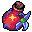</td><td>Concentré rouge de vie</td><td>Régénère toute ta vie instantanément</td><td>Usage unique</td></tr><tr><td>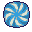</td><td>Pierre de téléportation</td><td>Téléportation sur un bloc que tu vises</td><td>Usage unique</td></tr><tr><td>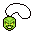</td><td>Gemme d'étoiles</td><td>Un nombre aléatoire d'étoiles à chaque fois que tu pêches un item</td><td>Usage unique</td></tr><tr><td></td><td>Lance de téléportation</td><td>Permet d'attirer tous les items au sol vers toi dans un rayon de <strong>10 blocs</strong></td><td>500$ par utilisation</td></tr><tr><td>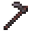</td><td>Houe de l'agriculteur</td><td>Permet de transformer la terre en terre labourrée sur un rayon de <strong>3 blocs</strong> </td><td>500$ par utilisation</td></tr><tr><td></td><td>Grappin</td><td>Permet de s'accrocher à de l'air ou un bloc</td><td>500$ par utilisation</td></tr><tr><td>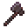</td><td>Hache Magique</td><td>Permet de couper un Arbre en un coup</td><td>25 ou 100 utilisations</td></tr><tr><td></td><td>Cisaille Magique</td><td>Permet d'enlever les feuilles d'un arbre en un coup</td><td>25 ou 100 utilisations</td></tr></tbody></table>

### Missions journalières

<figure><figcaption></figcaption></figure>

Tous les jours à 00H00, 5 nouvelles missions journalières sont tirés au sort.\
Voici la façon dont elles sont aléatoirement choisies : \
\
Pour chacune des 5 missions :

1. On choisit aléatoirement entre : "Pêcher, Miner, Placer, Récolter"
2. On choisit aléatoirement un nombre entre le minimum de la mission et le maximum de la mission
3. On choisit aléatoirement une récompense entre : "25K$, 50K$, Clé météore, Clé Bonus, Clé Quête, Clé Boutique, Clé Nébuleuse"

Vous pouvez ainsi réaliser **5 missions par jour**&#x20;

### Chat de proximité

Le chat de proximité permet de parler aux joueurs dans un rayon de 30 blocs. \
Pour y accéder, faites simplement **/audio** afin d'accéder à la page web. Mettez là en arrière-plan et voilà ! Plus rien à faire, tout est automatique.\
\
**Cette fonctionnalité est en fin de développement, elle n'est pas encore disponible publiquement. Des erreurs ont surgi juste avant l'ouverture, elle ne sera disponible que dans quelques jours /semaines.**&#x20;

### Spawn

#### Magasin de meubles

<figure><figcaption></figcaption></figure>

Le magasin de meuble vous permet d'acheter des objets de décoration custom ! Comme ce jolie coin de canapé Orange. :smile:

#### Magasin de karts

<figure><figcaption></figcaption></figure>

Le magasin de kart vous permet de faire spawn des karts utilisable seulement au spawn. C'est fun et sympa !

#### Echange de poissons

<figure><figcaption></figcaption></figure>

Dans la zone souterraine, venez échanger vos poissons au poissonnier.

#### Fontaine

<figure>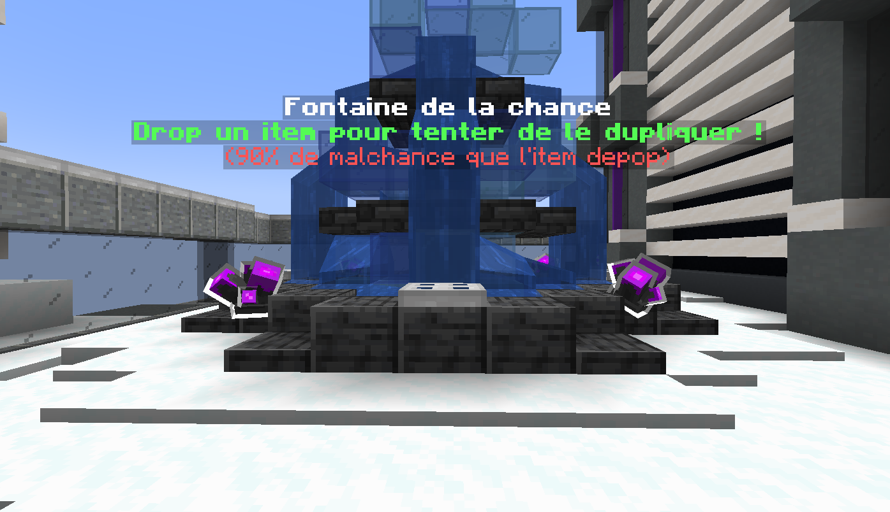<figcaption></figcaption></figure>

Drop tes items dans la fontaine, et vas-tu avoir la chance que ton item soit dupliqué ? !

(Attention ! Ton inventaire ne doit pas être remplie, sinon... C'est perdu d'office !)\
(10% de chance pour les non mvp+, et 20% pour les mvp+)

#### Casino

<figure>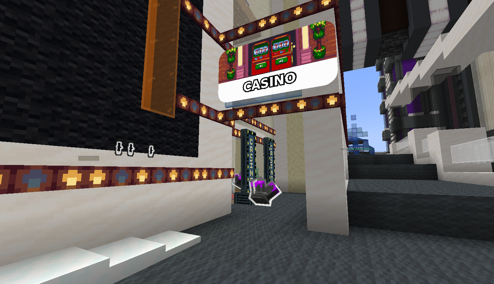<figcaption></figcaption></figure>

Le Casino, ou plutôt la zone aléatoire, vous permet de jouer à la slot machine afin d'obtenir des récompenses aléatoires. Attention ! Il faut acheter des jetons. .png>)

#### Bowling

<figure>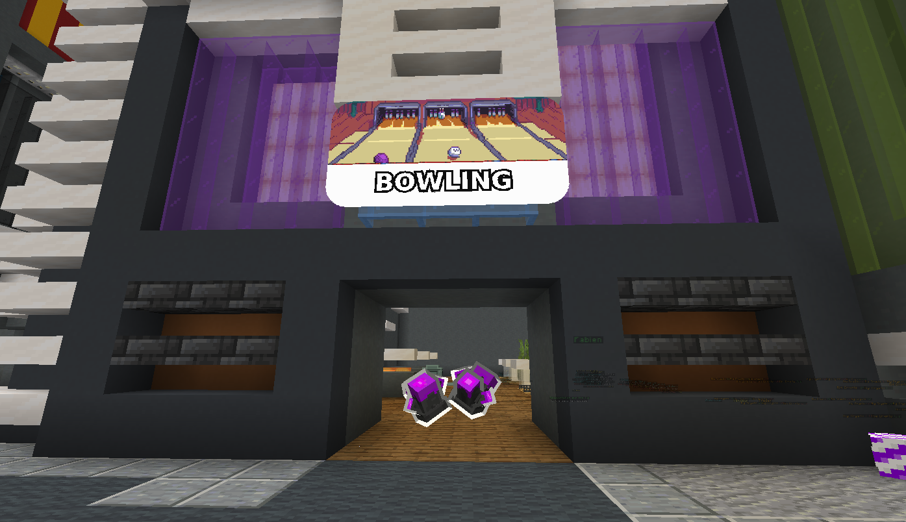<figcaption></figcaption></figure>

Fermé temporairement !&#x20;

#### Minigolf

<figure>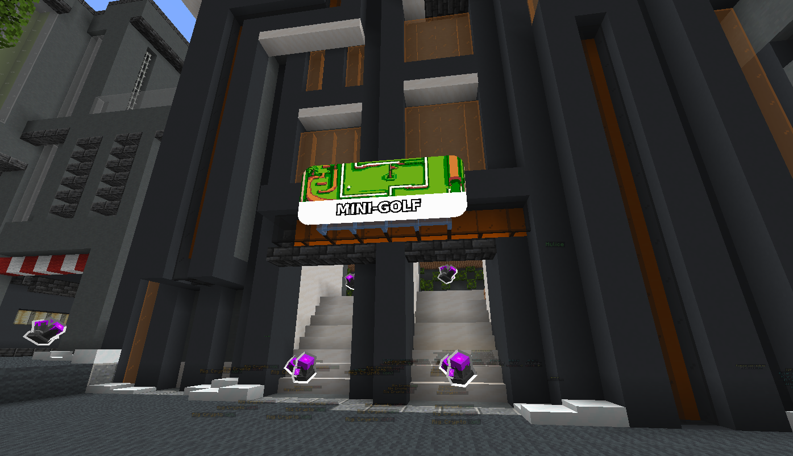<figcaption></figcaption></figure>

Fermé temporairement !&#x20;

#### Event largage

<figure>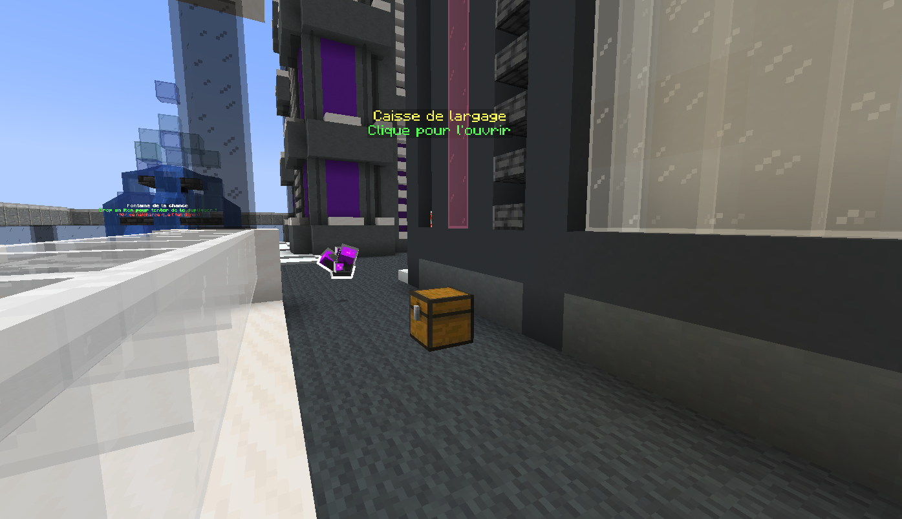<figcaption></figcaption></figure>

#### Affiches publicitaires

<figure>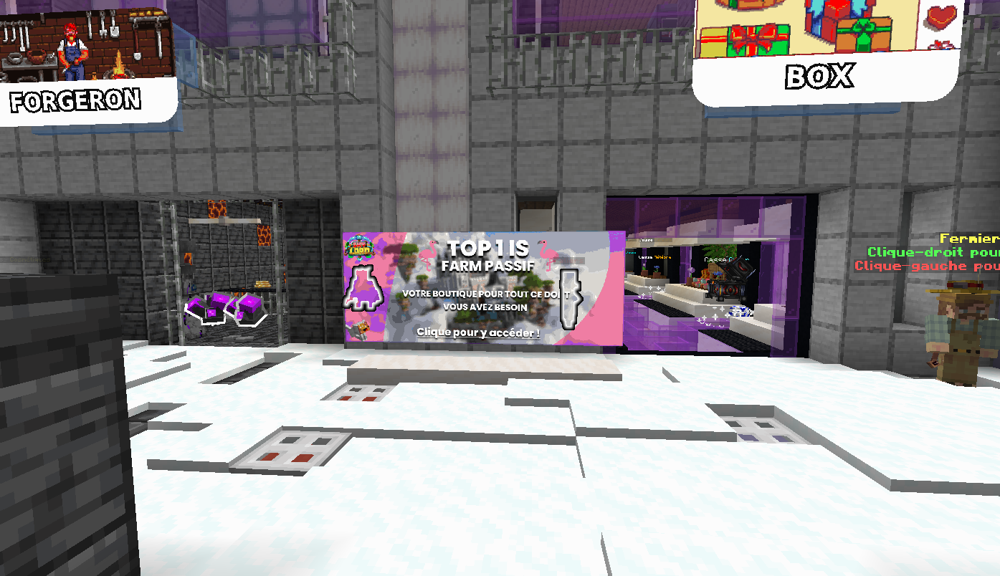<figcaption></figcaption></figure>

### Train de la Hype

<figure><figcaption></figcaption></figure>

<figure><figcaption></figcaption></figure>

Notre train de la Hype est atypique et unique. Voici son fonctionnement :&#x20;

Chaque achat boutique (en ligne ou en jeu), chaque vote, ajouté une valeur à la cagnotte, quand la cagnotte atteint la valeur 50, et quand il y a plus de 2 participants, le train de la hype se lance.\
La cagnotte devient alors public, et chacun peut ajouter dedans, ensuite la valeur de la cagnotte est divisée entre tous les participants.\
Donc la dans les images, il y a deux participants, et 64 en cagnottes. Il y aura donc 32 étoiles par participant.

### Kits

<figure><figcaption></figcaption></figure>

Les kits sont maintenant disponibles au **/kits**

Chaque grade apporte un kit supplémentaire (joueur, vip, vip+, mvp, mvp+)

Vous pouvez visualiser et acheter 7 autres kits au **/boutique -> kits**

### Générateur

<figure><figcaption></figcaption></figure>

Nous avons ajouter un système de mise à niveau du générateur par défaut, afin d'avancer plus vite dans votre aventure sur Skylord.\
Il y a 5 niveau disponible, et vous commencez tous au niveau 1.\
Pour accéder à l'interface, faites la commande **/is upgrade**

<table><thead><tr><th>Blocs</th><th>Niveau 1</th><th>Niveau 2</th><th>Niveau 3</th><th width="124">Niveau 4</th><th>Niveau 5</th></tr></thead><tbody><tr><td>Prix</td><td>0$</td><td>25K$</td><td>50K$</td><td>300K$</td><td>550K$</td></tr><tr><td></td><td>15%</td><td>15%</td><td>10%</td><td>8%</td><td>6%</td></tr><tr><td></td><td>51%</td><td>59%</td><td>44%</td><td>31.5%</td><td>23%</td></tr><tr><td></td><td>6%</td><td>0%</td><td>0%</td><td>0%</td><td>0%</td></tr><tr><td></td><td>6%</td><td>0%</td><td>0%</td><td>0%</td><td>0%</td></tr><tr><td></td><td>5%</td><td>6%</td><td>10%</td><td>12%</td><td>14%</td></tr><tr><td></td><td>5%</td><td>6%</td><td>10%</td><td>12%</td><td>14%</td></tr><tr><td></td><td>1%</td><td>2%</td><td>4%</td><td>6%</td><td>7%</td></tr><tr><td></td><td>1%</td><td>2%</td><td>4%</td><td>6%</td><td>7%</td></tr><tr><td></td><td>1%</td><td>2%</td><td>4%</td><td>6%</td><td>7%</td></tr><tr><td></td><td>1%</td><td>2%</td><td>4%</td><td>6%</td><td>7%</td></tr><tr><td></td><td>5%</td><td>6%</td><td>10%</td><td>12%</td><td>14%</td></tr><tr><td></td><td>0%</td><td>0%</td><td>0%</td><td>0.5%</td><td>0.5%</td></tr><tr><td></td><td>0%</td><td>0%</td><td>0%</td><td>0%</td><td>0.5%</td></tr></tbody></table>

### Divers

#### Ajouts du /menu

<figure><figcaption></figcaption></figure>

Dans le cadre d'une améliorations de la compréhension de notre serveur, vous avez accès à une interface, qui récapitule certains endroits essentiels au serveur (pas tous, car certains sont accessibles seulement par fusée).

Pour y accéder : **/menu**

Voici la liste des fonctionnalités :&#x20;

* Téléportation sur l'île
* Paramètres (C'est nouveau, et encore en BETA. Vous pouvez paramétrez l'affichage de certains choses sur le serveur, comme le scoreboard, quand l'inventaire est plein, etc..)
* Classement d'île
* Kits
* Votes
* Challenges
* Missions journalières
* Shop
* Métiers

## Les modifications

### Scotty

### Challenges

### Crafts

### Tutoriel

### Crypto-monnaie

#### Créateur d'essence

#### Rigs

### établi avancé

### Oréus

### Aerion

### Arborea

### Divers

#### Antidrop

#### GPS

#### Chat

#### Fusée

#### Boxs

#### Prix du forgeron

#### Délai d'expiration du /ah

#### Wiki & Zone informations

####

## Les corrections de bugs

Vous trouverez ci-dessous la liste des bugs corrigés du 5 Octobre au 25 Novembre

* L'affichage de la box Cyber "64 Fluorite", corrigé en "32 Fluorite"
* Le chat d'île qui compte dans le chat games
* L'ensemble des bugs du réparateur informatique
* Synchronisation des votes
* Le shop d'île quand le joueur n'est pas connecté, c'est maintenant bien relié à la banque d'île
* Le job boost est rectifié. Cependant les anciennes armures (avant le 25 Novembre) ont une forte probabilités d'avoir encore l'ancien boost jobs (un boost x2 qui en réalité sont des boost x3)
* L'évènement de farm est corrigé
* Les notifications de durabilité (Elles ne sont plus décalés)
* Le drop de lumifluide pour les minirobots
* L'écriture en rouge chez certains joueurs
* Le despawn des boss
* Les boss qui ne se font pas kill sur Mécanica
* Synchronisation du /ah
* bagues saturation (pas de différence d'effet entre le niveau 1, 2 et 3 (Bague 2 et 3 supprimé, le craft de la level 1 a été mis à celui de la level 2)
* Duplication des items au redémarrage
* Drop de tanzanite parfois quand on casse les blocs

