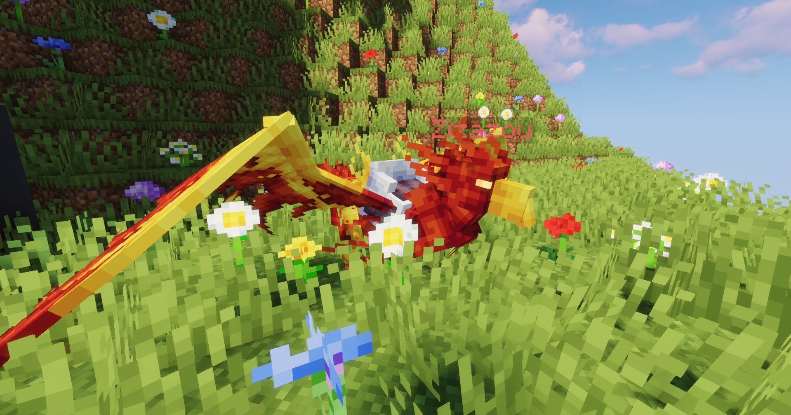
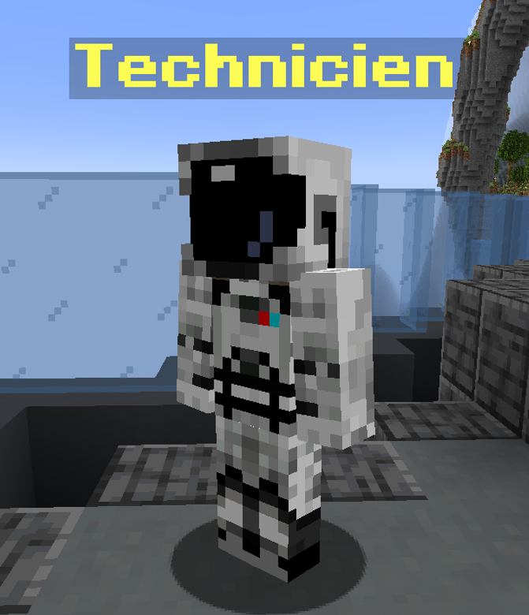
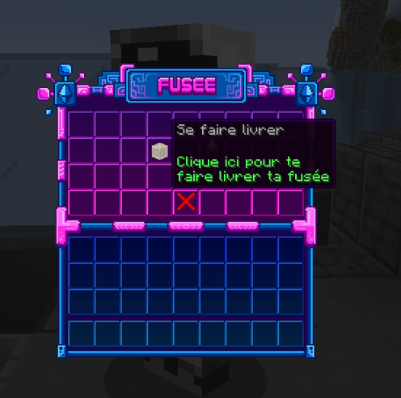
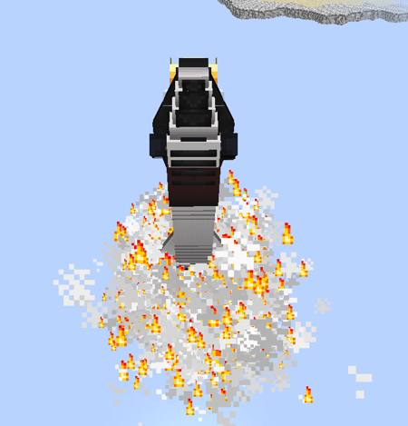
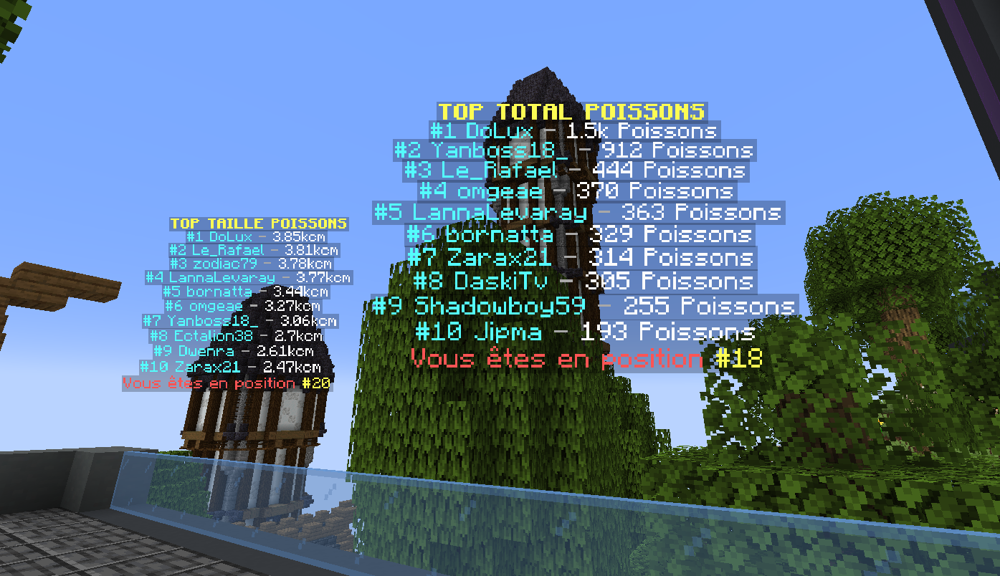
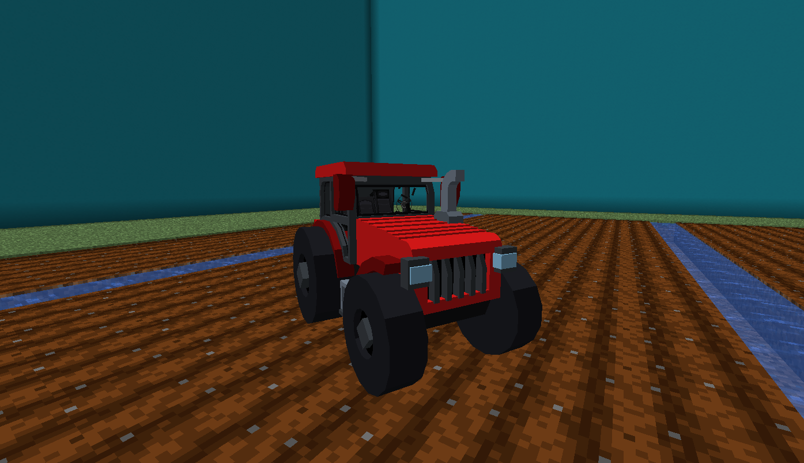
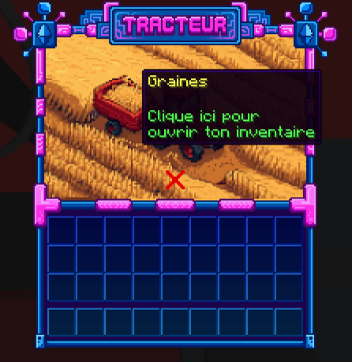

# Version 2.5.0 - Phoenotis

## Les nouvelles fonctionnalités

### Nouvelle Galaxie "Phoenotis"

<figure><figcaption></figcaption></figure>

Bienvenue dans la galaxie Phoenotis ! Explorez un ensemble d'astéroïdes, chacun offrant sa propre particularité et la possibilité d'adopter 29 montures uniques qui les peuplent.

#### Les astéroïdes

Les astéroïdes se présentent comme des îles flottantes, chacun arborant un thème spécifique tel que le fantastique, le mécanique, le médiéval, voire même les glaciers. Certains d'entre eux abritent des villages, comme celui des Capybara ou encore des pandas.

Pour les parcourir, vous avez la possibilité d'utiliser le Technicien (ci-dessous). Il est à votre gauche quand vous atterrissez sur la galaxie Phoenotis.

<figure><figcaption></figcaption></figure>

Le technicien va vous servir à faire apparaitre votre fusée, afin de voyager à travers Phoenotis, car à pied c'est impossible, il y a du vide !

<figure><figcaption></figcaption></figure>

<figure><figcaption></figcaption></figure>

#### Les montures

Je vous présente Zizazou, mon Pheonix de feu ! (image de couverture) En effet, sur la mise à jour Phoenotis vous aurez la possibilité d'adopter 29 montures, qui sont plus ou moins rare et difficile à adopter !

**Comment faut-il faire pour les adopter ?**

* Etape 1 : Vous devez récupérer une pierre de âmes, vous en trouvez en cassant des herbes ou fleurs sur les différents astéroides de Phoenotis&#x20;
* Etape 2 : Attendre que les créatures apparaissent (chaque créatures spawn dans des zones spécifiques, elles sont inscrites dans le scoreboard et au milieu de l'écran quand on change de zone), et de lui donner une pierre des âmes. (Vous aurez plus ou moins de chance suivant les créatures)

**Elles servent à quoi ?**

* Elles vous servent à les chevaucher pour aller plus vite&#x20;
* Elles vous aideront à tuer les mobs, car elles sont évolutives en fonction de l'exp gagné (exp que vous gagnez quand vous tuez ou que votre monture tue des mobs), et à chaque fois, elle aura plus de résistance et plus de dégâts. Contrairement à Scotty, qui lui vous donne des effets, la la monture c'est elle qui s'auto gère.&#x20;
* Pour le style ! Afficher devant tous le monde que vous avez réussi à adopter une monture super rare (clin d'oeil aux dragons)

Les différentes améliorations de vos montures :

| Fonctions        | Bébé (défaut) | Enfant | Ado | Lycéen | Etudiant | Adulte | Senior |
| ---------------- | ------------- | ------ | --- | ------ | -------- | ------ | ------ |
| EXP Requis       | 0             | 200    | 300 | 600    | 900      | 1500   | 5000   |
| Vie              | 200           | 300    | 400 | 500    | 600      | 700    | 800    |
| Régénération     | 0.1           | 0.2    | 0.3 | 0.4    | 0.5      | 0.6    | 0.7    |
| Résistance       | 1             | 2      | 3   | 4      | 5        | 6      | 7      |
| Dégâts           | 1             | 2      | 3   | 4      | 5        | 6      | 7      |
| Puissance        | 1             | 2      | 3   | 4      | 5        | 6      | 7      |
| Délai de respawn | 15            | 7      | 7   | 7      | 7        | 7      | 7      |

#### La pêche custom

Une autre nouveauté spécialement disponible sur Phoenotis, c'est la pêche custom !\
Chaque item ou poissons que vous allez pêcher seront catégorisés de cette façon :&#x20;

* Basique
* Rare
* Légendaire

Il faut faire attention, certains items custom pêché sont de simples items, et ne peuvent être vendu ! (Comme bob l'éponge, qui est une simple éponge)

Un classement est aussi disponible afin d'avoir un peu de compétitions entre vous !&#x20;

<figure><figcaption></figcaption></figure>

### L'agriculture

#### Achat de graines

Avant de commencer toute plantation, il vous faut acheter des graines.

Vous trouerez au /spawn un fermier. Faites clique-gauche dessus pour ouvrir l'achat de graines.

#### Activation du tracteur

Pour faire apparaitre votre Tracteur, il suffit simplement de faire **/tracteur** sur votre île&#x20;

<figure><figcaption></figcaption></figure>

Vous avez ensuite deux fonctionnalités :&#x20;

#### Gestion des graines

Cliquez sur la remorque dans l'inventaire du tracteur : 

Vous avez maintenant une liste de graines, il vous suffit de faire clique gauche pour ajouter +1 graine ou clique droit pour en enlever 1.

<figure><figcaption></figcaption></figure>

#### Gestion du tracteur

Cliquez sur la tracteur dans l'inventaire du tracteur : .png>)

Vous avez deux fonctionnalités dans cette inventaire, la première c'est le type de graine sélectionné.\
C'est se que votre tracteur pourra planter. 

Vous avez ensuite la fonction du tracteur. Il y a pour le moment la **moisson**  qui permet au tracteur de récolter les plantations, qu'elles soient totalement poussés ou non.\
Mais aussi le fonction de **plantation** qui permet de planter la graine choisis dans la graine sélectionnée.&#x20;

#### Ventes des plantations

La dernière étape, c'est la vente des plantations, il vous suffit d'aller revoir le fermier au spawn&#x20;

### Outils

### Missions journalières

### Chat de proximité

### Spawn

#### Magasin de meubles

#### Magasin de karts

#### Echange de poissons

#### Fontaine

#### Casino

#### Bowling

#### Minigolf

#### Event largage

#### Affiches publicitaires

### Train de la Hype

### Kits

### Générateur

### Divers

#### Ajouts du /menu

## Les modifications

### Scotty

### Challenges

### Crafts

### Tutoriel

### Crypto-monnaie

#### Créateur d'essence

#### Rigs

### établi avancé

### Oréus

### Aerion

### Arborea

### Divers

#### Antidrop

#### GPS

#### Chat

#### Fusée

#### Boxs

#### Prix du forgeron

#### Délai d'expiration du /ah

#### Wiki & Zone informations

####

## Les corrections de bugs

Vous trouverez ci-dessous la liste des bugs corrigés du 5 Octobre au 25 Novembre

* L'affichage de la box Cyber "64 Fluorite", corrigé en "32 Fluorite"
* Le chat d'île qui compte dans le chat games
* L'ensemble des bugs du réparateur informatique
* Synchronisation des votes
* Le shop d'île quand le joueur n'est pas connecté, c'est maintenant bien relié à la banque d'île
* Le job boost est rectifié. Cependant les anciennes armures (avant le 25 Novembre) ont une forte probabilités d'avoir encore l'ancien boost jobs (un boost x2 qui en réalité sont des boost x3)
* L'évènement de farm est corrigé
* Les notifications de durabilité (Elles ne sont plus décalés)
* Le drop de lumifluide pour les minirobots
* L'écriture en rouge chez certains joueurs
* Le despawn des boss
* Les boss qui ne se font pas kill sur Mécanica
* Synchronisation du /ah
* bagues saturation (pas de différence d'effet entre le niveau 1, 2 et 3 (Bague 2 et 3 supprimé, le craft de la level 1 a été mis à celui de la level 2)
* Duplication des items au redémarrage
* Drop de tanzanite parfois quand on casse les blocs

##

###
